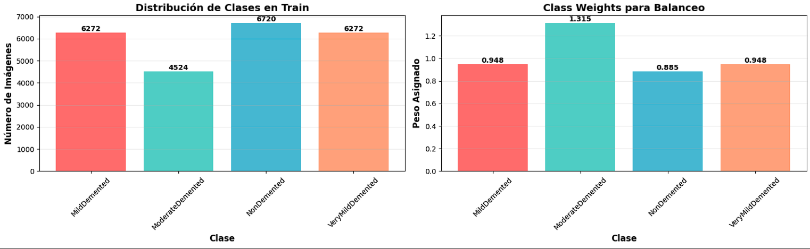
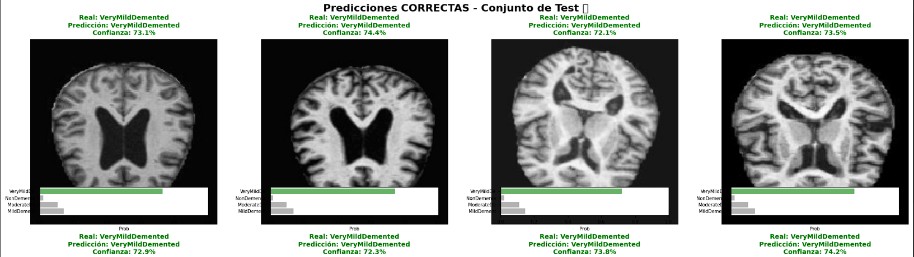
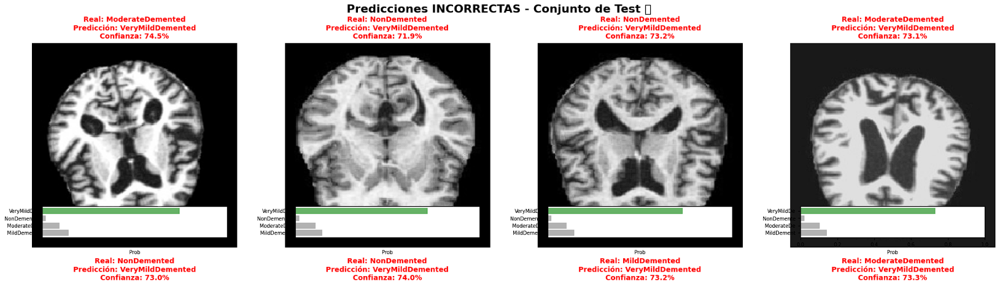
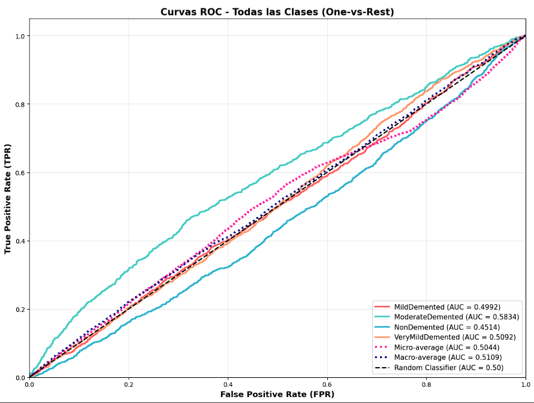
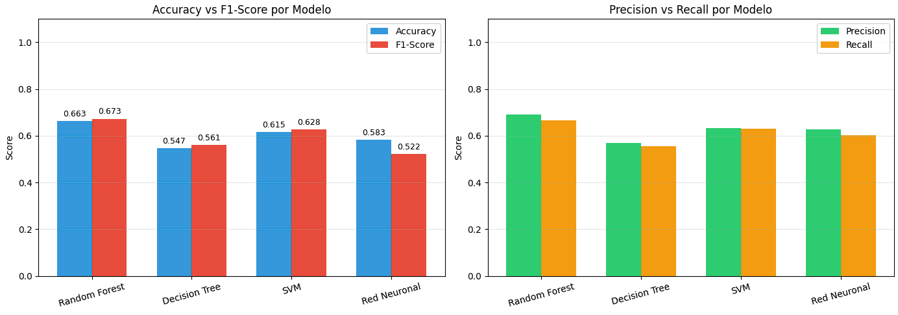
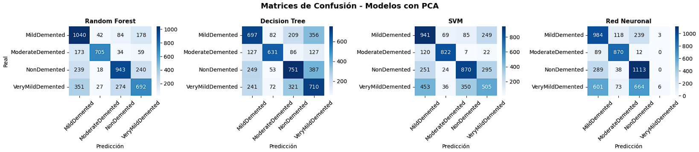

# ia1-Matrix_3.0-Es-Demente-


### **🧠 Exploración del Dataset de Alzheimer (EDA)**

---

### **Descripción del Dataset**

**Nombre:** [Alzheimer Disease Dataset](https://www.kaggle.com/datasets/ashrafulhossenakash/alzheimer-disease-dataset/data)

**Fuente:** [Kaggle](https://www.kaggle.com/datasets/ashrafulhossenakash/alzheimer-disease-dataset/data)

🔗[**Primera Entrega**](https://colab.research.google.com/drive/1N81qKQA5Ofw4HkcyCfOZbRbB5-XMNCf-?usp=drive_link)
🔗[**Segunda Entrega**](https://colab.research.google.com/drive/1zFFQE-LXShM0d3d-oIIK-AkMYMPPP9z8?usp=sharing)
🔗[**Tercera Entrega**](https://colab.research.google.com/drive/1ZUsee2ZCrENj-HDeFxn0vh2CmeV3LXFz?usp=sharing)

**Contenido:** Alrededor de 34 mil imagenes de resonancias magnéticas cerebrales, clasificadas en cuatro etapas de la enfermedad: **NonDemented, VeryMildDemented, MildDemented y ModerateDemented.** y en diferente estados: tren(entrenamiento), pruebas y val (valoracion).

---

### **Pre-Análisis Conceptual** 💡

#### **El Problema: Detección Temprana del Alzheimer**

El Alzheimer es una enfermedad neurodegenerativa que impacta severamente la calidad de vida. 😞 Su diagnóstico temprano es crucial para iniciar tratamientos a tiempo y ofrecer un mejor soporte. La detección tradicional es compleja, por lo que usar resonancias magnéticas y modelos de IA ofrece una vía prometedora para un diagnóstico rápido, estandarizado y automatizado. Esta aproximación podría ser un apoyo valioso para los especialistas.

#### **Objetivo del Análisis (EDA)** 🎯

Nuestro objetivo es entender la estructura y las características de este dataset. ¿Está balanceado? ¿Qué calidad tienen las imágenes? Este análisis exploratorio nos ayudará a identificar desbalances y desafíos inherentes a los datos, lo que es clave para diseñar una estrategia de preprocesamiento robusta. Un EDA bien hecho es el primer paso para entrenar un modelo de clasificación eficaz.

#### **Métricas Clave** 📊

Para evaluar el rendimiento del modelo, usaremos:

* **Accuracy:** Para una visión global del acierto.
* **Precision, Recall y F1-score:** Cruciales para entender cómo el modelo se comporta con cada clase, especialmente las menos representadas.
* **Matriz de Confusión:** Nos permitirá visualizar los errores de clasificación y entender qué clases se confunden más.
* **AUC-ROC:** Para medir la capacidad del modelo para distinguir entre las diferentes etapas de la enfermedad.

Estas métricas son vitales para asegurar que nuestro modelo no solo sea preciso, sino también confiable.

#### **Nuestra Motivación** 💖

El impacto social y clínico del Alzheimer es inmenso. Queremos aplicar la inteligencia artificial a un problema del mundo real con el potencial de generar valor significativo. El reto de usar la visión por computadora para la detección temprana de esta enfermedad nos permite combinar tecnología de vanguardia con un propósito humanitario.

---

### **Post-Análisis (Basado en Datos)** 🔍

#### **Datos Utilizados**

Trabajamos con imágenes de resonancia magnética cerebral, provenientes de Kaggle, organizadas en carpetas para entrenamiento, validación y prueba. El dataset incluye tanto imágenes originales como versiones "aumentadas" (generadas con rotaciones y cambios de contraste) para mejorar la robustez del modelo.

#### **Contenido del Dataset** 🖼️

Las imágenes son cortes axiales del cerebro en escala de grises, etiquetadas como **NonDemented, VeryMildDemented, MildDemented y ModerateDemented**. La inclusión de imágenes aumentadas es un factor clave, ya que introduce variaciones útiles y evita el sobreajuste. La división en subconjuntos (train, val, test) nos permite realizar un entrenamiento y una evaluación justos, asegurando que el modelo se pruebe con datos que nunca ha visto.

#### **Desafíos Identificados** ⚠️

Durante el EDA, detectamos varios retos a considerar:

* **Desbalance de Clases:** La cantidad de imágenes no es uniforme en todas las categorías, lo que podría sesgar el modelo.
* **Ruido en las Imágenes Aumentadas:** Aunque útiles, estas imágenes podrían introducir variaciones irrelevantes.
* **Tamaño del Dataset:** Aunque grande para un proyecto académico, puede ser limitado para entrenar modelos de *deep learning* de gran escala.
* **Limitación Clínica:** El dataset se enfoca únicamente en las resonancias, sin incluir otros datos clínicos vitales (edad, género, etc.).


Perfecto Harold 🙌. Aquí tienes el **README.md completo**, con todos los títulos y fragmentos de código ya integrados, listo para que lo copies y pegues en tu repositorio:

---

[**🔼Volver al inicio**](#ia1-matrix_3.0-es-demente-)


# 🧠 Clasificación de Alzheimer con CNN + Transfer Learning

Este proyecto implementa un modelo de **red neuronal convolucional (CNN)** utilizando **EfficientNetB0** con *transfer learning* para la clasificación de imágenes de resonancias cerebrales en cuatro categorías relacionadas con el Alzheimer:

- **NonDemented**
- **VeryMildDemented**
- **MildDemented**
- **ModerateDemented**

---

## 📌 Paso a paso del proyecto

### 1. Descarga del dataset
El primer paso fue obtener el dataset desde Kaggle. Este conjunto contiene imágenes de resonancias cerebrales organizadas en carpetas para entrenamiento, validación y prueba.  
Esto asegura que el modelo se entrene con datos distintos a los que se usarán para evaluar su desempeño.

```python
import kagglehub

# Descargar dataset desde Kaggle
path = kagglehub.dataset_download("ashrafulhossenakash/alzheimer-disease-dataset")
print("Dataset descargado en:", path)
```

---

### 2. Exploración del dataset
Antes de entrenar, se verificó la distribución de imágenes por clase y conjunto.  
Este análisis inicial permite identificar posibles desbalances de clases y entender la estructura del dataset.

```python
import os

train_path = os.path.join(path, "Alzheimer_Dataset_V2/train")
classes = sorted(os.listdir(train_path))
print("Clases detectadas:", classes)
```
### 📊Distribucion de Clases


---

### 3. Configuración de parámetros globales
Se definieron parámetros clave como el tamaño de las imágenes, número de épocas, tasa de aprendizaje y nombres de las clases.  
Estos valores controlan el entrenamiento y permiten reproducir los resultados.

```python
IMG_HEIGHT, IMG_WIDTH, IMG_CHANNELS = 224, 224, 3
BATCH_SIZE = 32
EPOCHS = 50
LEARNING_RATE = 0.0001
NUM_CLASSES = 4
CLASS_NAMES = ['MildDemented','ModerateDemented','NonDemented','VeryMildDemented']
```

---

### 4. Generadores de datos con Data Augmentation
Para mejorar la robustez del modelo, se aplicaron técnicas de *data augmentation*.  
Esto introduce variaciones en las imágenes (rotaciones, zoom, flips) y ayuda a evitar el sobreajuste.

```python
from tensorflow.keras.preprocessing.image import ImageDataGenerator

train_datagen = ImageDataGenerator(
    rescale=1./255,
    rotation_range=15,
    width_shift_range=0.1,
    height_shift_range=0.1,
    shear_range=0.1,
    zoom_range=0.1,
    horizontal_flip=True
)

val_datagen = ImageDataGenerator(rescale=1./255)
test_datagen = ImageDataGenerator(rescale=1./255)
```

---

### 5. Construcción del modelo CNN (Transfer Learning)
Se utilizó **EfficientNetB0** como base preentrenada en ImageNet.  
Las capas iniciales se congelaron para preservar el conocimiento previo y se añadieron capas densas personalizadas para la clasificación en 4 categorías.

```python
from tensorflow.keras.applications import EfficientNetB0
from tensorflow.keras.models import Sequential
from tensorflow.keras.layers import Dense, Dropout, BatchNormalization, GlobalAveragePooling2D

base_model = EfficientNetB0(
    include_top=False,
    weights="imagenet",
    input_shape=(IMG_HEIGHT, IMG_WIDTH, IMG_CHANNELS)
)
base_model.trainable = False  # Fase 1: congelar capas

model = Sequential([
    base_model,
    GlobalAveragePooling2D(),
    Dense(512, activation='relu'), BatchNormalization(), Dropout(0.5),
    Dense(256, activation='relu'), BatchNormalization(), Dropout(0.4),
    Dense(128, activation='relu'), BatchNormalization(), Dropout(0.3),
    Dense(NUM_CLASSES, activation='softmax')
])
```

---

### 6. Compilación del modelo
Se definió el optimizador **Adam**, la función de pérdida *categorical crossentropy* y la métrica principal *accuracy*.  
Esto permite entrenar el modelo de manera eficiente y evaluar su desempeño.

```python
from tensorflow.keras.optimizers import Adam

model.compile(
    optimizer=Adam(learning_rate=LEARNING_RATE),
    loss="categorical_crossentropy",
    metrics=["accuracy"]
)
```

---

### 7. Callbacks configurados
Se añadieron callbacks para mejorar el entrenamiento:  
- **ModelCheckpoint**: guarda el mejor modelo.  
- **EarlyStopping**: detiene el entrenamiento si no hay mejoras.  
- **ReduceLROnPlateau**: ajusta la tasa de aprendizaje automáticamente.

```python
from tensorflow.keras.callbacks import ModelCheckpoint, EarlyStopping, ReduceLROnPlateau

checkpoint = ModelCheckpoint("best_model.h5", monitor="val_accuracy", save_best_only=True)
early_stop = EarlyStopping(monitor="val_loss", patience=10, restore_best_weights=True)
reduce_lr = ReduceLROnPlateau(monitor="val_loss", patience=5, factor=0.5)
```

---

### 8. Entrenamiento del modelo
Finalmente, se entrenó el modelo utilizando los generadores de datos y los *class weights* calculados para compensar ligeros desbalances.  
El historial de entrenamiento se almacenó para luego graficar las curvas de *loss* y *accuracy*.

```python
history = model.fit(
    train_generator,
    validation_data=val_generator,
    epochs=EPOCHS,
    callbacks=[checkpoint, early_stop, reduce_lr],
    class_weight=class_weights_dict
)
```


---

## 📊 Resultados esperados

- **Distribución de clases**
      

- **Ejemplos de imágenes del dataset**
  - *Imagenes Predichas Correctas* 
      
  - *Imagenes Predichas Incorrectas*
      

- **Curvas de entrenamiento**
      
---

[**🔼 Volver al inicio**](#ia1-matrix_3.0-es-demente-)

# 🧠 Clasificación de Alzheimer con PCA y Modelos Supervisados

Este proyecto aplica **reducción de dimensionalidad (PCA)** y distintos algoritmos de **clasificación supervisada** sobre imágenes de resonancias cerebrales para identificar estados de demencia.

---

## ⚙️ Flujo de trabajo

### 1. **Carga y preparación de datos**
- Se descargó el dataset de Alzheimer desde Kaggle.
- Se cargaron imágenes en escala de grises, redimensionadas a 64x64.
- Se dividieron en conjuntos de entrenamiento y prueba.

```python
# Carga optimizada de imágenes
X_train, y_train = load_images(TRAIN_PATH, CLASSES)
X_test, y_test   = load_images(TEST_PATH, CLASSES)
print(f"Train: {X_train.shape}, Test: {X_test.shape}")
```

---

### 2. **Aplanado y reducción de dimensionalidad con PCA**
- Se aplanaron las imágenes (64x64 → 4096 features).
- Se estandarizaron los datos.
- Se aplicó PCA con 50 componentes, reteniendo ~80% de la varianza.

```python
from sklearn.preprocessing import StandardScaler
from sklearn.decomposition import PCA

X_train_flat = X_train.reshape(X_train.shape[0], -1)
X_test_flat  = X_test.reshape(X_test.shape[0], -1)

scaler = StandardScaler()
X_train_scaled = scaler.fit_transform(X_train_flat)
X_test_scaled  = scaler.transform(X_test_flat)

pca = PCA(n_components=50, random_state=42)
X_train_pca = pca.fit_transform(X_train_scaled)
X_test_pca  = pca.transform(X_test_scaled)

print(f"Varianza explicada: {sum(pca.explained_variance_ratio_)*100:.2f}%")
```

---

### 3. **Entrenamiento de modelos supervisados**
Se entrenaron tres modelos clásicos y una red neuronal:
- **Random Forest** → mejor desempeño (Accuracy ≈ 0.66, F1 ≈ 0.67).
- **Decision Tree** → desempeño más bajo.
- **SVM (RBF)** → resultados intermedios.
- **Red Neuronal (MLP compacto)** → Accuracy ≈ 0.58.

```python
# Random Forest
from sklearn.ensemble import RandomForestClassifier
rf = RandomForestClassifier(n_estimators=100, max_depth=15, random_state=42, n_jobs=-1)
rf.fit(X_train_pca, y_train)
y_pred_rf = rf.predict(X_test_pca)
```

```python
# Red Neuronal
from tensorflow.keras.models import Sequential
from tensorflow.keras.layers import Dense, Dropout, BatchNormalization

model = Sequential([
    Dense(128, activation='relu', input_shape=(50,)),
    BatchNormalization(),
    Dropout(0.3),
    Dense(64, activation='relu'),
    Dropout(0.2),
    Dense(32, activation='relu'),
    Dense(4, activation='softmax')
])
model.compile(optimizer='adam', loss='categorical_crossentropy', metrics=['accuracy'])
```

---

### 4. **Evaluación y comparación**
- Se calcularon métricas: Accuracy, F1, Precision, Recall.
- Se generaron **tablas comparativas**, **gráficas de métricas**, **matrices de confusión** y **curvas de pérdida** para la red neuronal.
- El **Random Forest** fue el modelo más robusto en este flujo.

```python
import pandas as pd
df_results = pd.DataFrame(results)
print(df_results.sort_values("F1-Score", ascending=False))
```

**Resultado Evaluacion metricas**
 


**Matriz de Confusion**
 


Esto deja claro que **Random Forest con PCA** fue la mejor opción en este caso, aunque se exploraron alternativas como SVM y redes neuronales.

---

### **Curso:** Inteligencia Artificial I -2025-2 C1
### **Grupo:** Matrix 3.0
### **Integrantes:**
* Harold Esteban Duran Osma-2225113
* Yeison Steven Ovalle Manjarres-2225115
* David Santiago Sáenz Ortiz-2215506
